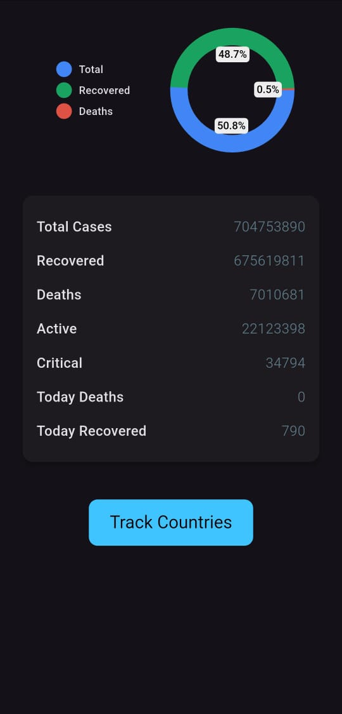
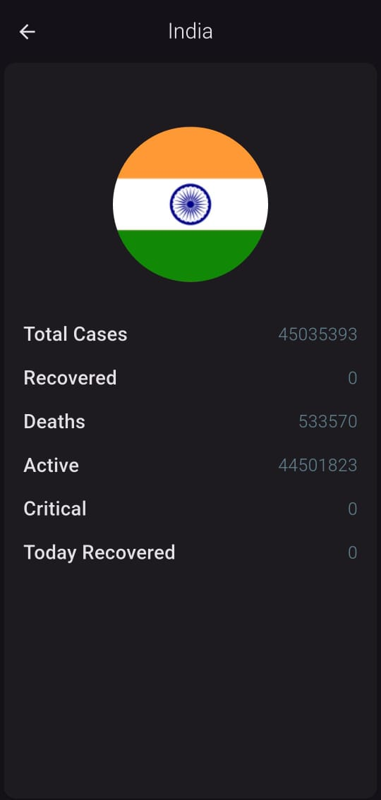
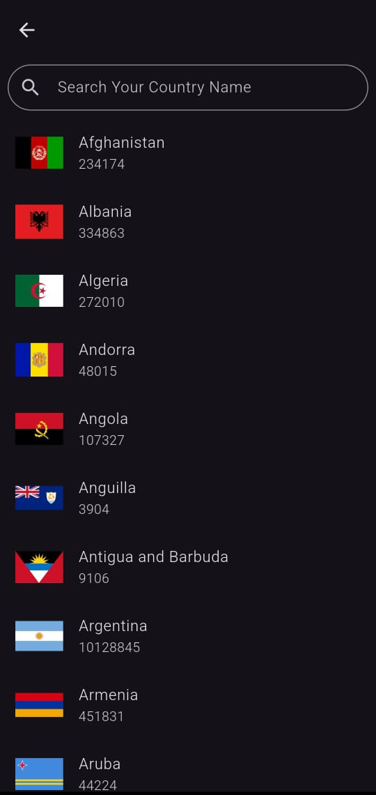
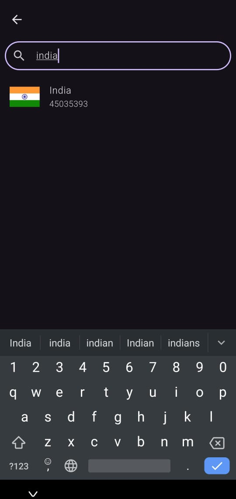

🦠 COVID Data Tracker App
This app tracks COVID-19 stats globally and per country using Flutter and REST APIs. It includes live statistics, search functionality, country-wise breakdown, and animations for better UX.

✨ Features
🌍 Global & country-wise COVID-19 data

🔍 Real-time search filter with debounce

🎯 Clean and intuitive UI

📊 Doughnut chart for quick glance

🌀 Shimmer animation before data loads

📱 Fully responsive layout

## 📸 Screenshots

<table>
  <tr>
    <td align="center">
      <b>🏠 Home Screen</b> 
      
    </td>
    <td width="30"></td>
    <td align="center">
      <b>📊 Country Data Screen</b> 
      
    </td>
  </tr>
  <tr><td colspan="3"> </td></tr>
  <tr>
    <td align="center">
      <b>✨ Before Search Animation</b> 
      
    </td>
    <td align="center">
      <b>🌍 Countries List</b> 
      
    </td>
    <td align="center">
      <b>🔍 Search Feature</b> 
      
    </td>
  </tr>
</table>